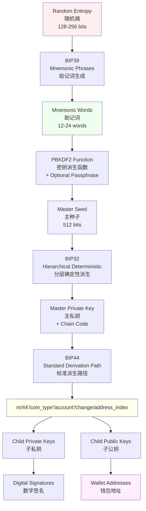
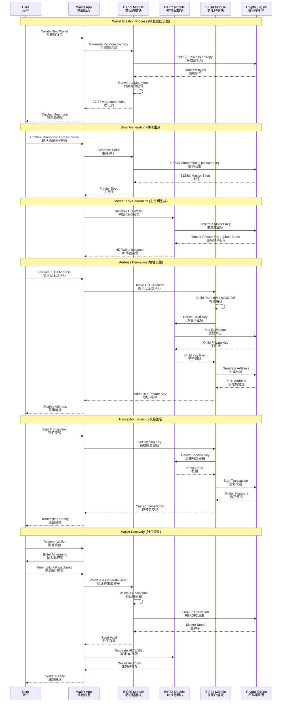

# Wallet Module

## Overview

本模块实现了基于BIP标准的分层确定性钱包功能，支持助记词生成、种子派生和多币种地址管理。

## BIP Standards Introduction

### BIP39 - Mnemonic Phrases (助记词)

BIP39定义了一种将随机熵转换为人类可读助记词的标准方法。

**主要特点：**

- 将128-256位的随机熵转换为12-24个助记词
- 支持多种语言的词汇表（英语、中文、日语等）
- 提供校验和机制确保助记词的有效性
- 通过PBKDF2函数将助记词转换为512位种子

**用途：**

- 便于用户备份和恢复钱包
- 提供人类友好的随机数表示方法
- 跨钱包兼容性

### BIP32 - Hierarchical Deterministic Wallets (分层确定性钱包)

BIP32定义了从单个种子生成一系列密钥对的标准，实现了分层确定性钱包。

**主要特点：**

- 从单个主种子派生无限数量的子密钥
- 支持公钥和私钥的独立派生
- 提供强化派生和非强化派生两种模式
- 使用链码(Chain Code)确保派生的安全性

**密钥派生路径：**

```
m / purpose' / coin_type' / account' / change / address_index
```

**用途：**

- 单一备份管理多个地址
- 支持确定性地址生成
- 提供账户隔离和隐私保护

### BIP44 - Multi-Account Hierarchy for Deterministic Wallets (多账户分层结构)

BIP44在BIP32基础上定义了标准的派生路径结构，为不同币种和账户提供统一的组织方式。

**标准路径结构：**

```
m / 44' / coin_type' / account' / change / address_index
```

**路径参数说明：**

- `44'`: BIP44标准标识符（强化派生）
- `coin_type'`: 币种类型（如Bitcoin=0, Ethereum=60）
- `account'`: 账户索引（从0开始）
- `change`: 找零地址标识（0=接收地址，1=找零地址）
- `address_index`: 地址索引（从0开始）

**用途：**

- 标准化多币种钱包结构
- 提供账户级别的资产隔离
- 确保不同钱包软件间的兼容性

## Standards Relationship Flowchart

### Process Flow Diagram



### Sequence Diagram - Wallet Creation and Usage



## Implementation Features

### 支持的功能

1. **助记词管理**
   
   - 生成符合BIP39标准的助记词
   - 验证助记词有效性
   - 支持多语言词汇表

2. **分层密钥派生**
   
   - 实现BIP32标准的密钥派生
   - 支持强化和非强化派生
   - 公钥独立派生功能

3. **多币种支持**
   
   - 按照BIP44标准支持多种加密货币
   - 标准化的派生路径
   - 账户级别的资产隔离

4. **安全特性**
   
   - 安全的随机数生成
   - 内存敏感数据清理
   - 密码学安全的哈希函数

### 使用示例

```typescript
// 生成助记词
const mnemonic = generateMnemonic();

// 从助记词创建钱包
const wallet = createWalletFromMnemonic(mnemonic);

// 派生以太坊地址
const ethereumAddress = wallet.deriveAddress("m/44'/60'/0'/0/0");

// 派生比特币地址
const bitcoinAddress = wallet.deriveAddress("m/44'/0'/0'/0/0");
```

## Security Considerations

1. **助记词安全**
   
   - 妥善保管助记词，避免泄露
   - 考虑使用passphrase增强安全性
   - 定期备份验证

2. **密钥管理**
   
   - 避免重复使用地址
   - 使用强化派生保护上级密钥
   - 及时清理内存中的敏感数据

3. **实现安全**
   
   - 使用经过验证的密码学库
   - 实施适当的输入验证
   - 考虑硬件安全模块(HSM)集成
